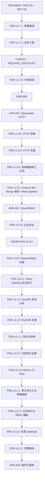

# 文档索引

**文档编号**: DOCS-INDEX
**版本**: 1.1
**日期**: 2026-07-10
**状态**: 当前有效
**用途**: 帮助维护者快速判断哪些文档是当前规划依据，哪些是历史参考。

---

## 一、推荐阅读顺序

### 1.1 新贡献者

1. `README.md`：了解项目用途、安装和基本配置。
2. `AGENTS.md`：了解本仓库对自动化代理的工作约束。
3. `docs/API.md`：了解当前工具接口。
4. `docs/CONFIG.md`：了解环境变量、连接对象和安全配置。
5. `docs/ERRORS.md`：了解错误码和排障提示。
6. `docs/ROADMAP.md`：了解长期方向和版本边界。
7. 最新 `docs/ITER-*.md`：了解当前迭代任务。

### 1.2 维护者

1. `docs/ROADMAP.md`
2. `docs/ITER-v1.7.1-迭代计划.md`
3. `docs/ITER-v1.7.2-迭代计划.md`
4. `docs/ITER-v1.7.3-迭代计划.md`
5. `docs/CONFIG.md`
6. `docs/ERRORS.md`
7. `docs/RELEASE_CHECKLIST.md`
8. `docs/ADR-001-streamable-http.md`
9. `docs/PRD-v1.8.0.md`
10. `docs/ITER-v1.8.0-迭代计划.md`
11. `docs/PRD-v1.9.0.md`
12. `docs/ITER-v1.9.0-迭代计划.md`
13. `docs/ADR-002-oauth-rbac.md`
14. `docs/PRD-v2.0.0.md`
15. `docs/MIGRATION-v2.0.0.md`
16. `docs/ITER-v2.0.0-迭代计划.md`
17. `docs/ITER-v2.0.1-迭代计划.md`
18. `docs/PRD-v2.1.0.md`
19. `docs/ITER-v2.1.0-迭代计划.md`
20. `docs/ITER-v2.1.1-迭代计划.md`
21. `docs/PRD-v2.2.0.md`
22. `docs/ITER-v2.2.0-迭代计划.md`
23. `docs/PRD-v2.2.1.md`
24. `docs/ITER-v2.2.1-迭代计划.md`
25. `docs/PRD-v2.2.2.md`
26. `docs/ITER-v2.2.2-迭代计划.md`
27. `docs/ADR-003-plugin-architecture.md`
28. `docs/PLANNING_AUDIT.md`
29. `docs/QUALITY-v1.7.1-质量报告.md`
30. `docs/QUALITY-v1.7.2-质量报告.md`
31. `docs/QUALITY-v1.7.3-质量报告.md`
32. `docs/QUALITY-v1.8.0-质量报告.md`
33. `docs/QUALITY-v1.9.0-质量报告.md`
34. `docs/QUALITY-v2.0.0-质量报告.md`
35. `docs/QUALITY-v2.0.1-质量报告.md`
36. `docs/QUALITY-v2.1.0-质量报告.md`
37. `docs/QUALITY-v2.1.1-质量报告.md`
38. `docs/QUALITY-v2.2.0-质量报告.md`
39. `docs/QUALITY-v2.2.1-质量报告.md`
40. `docs/QUALITY-v2.2.2-质量报告.md`
41. `docs/QUALITY-v1.7.0-质量报告.md`
42. `CHANGELOG.md`

### 1.3 发布负责人

1. `docs/RELEASE_CHECKLIST.md`
2. `docs/ITER-v1.7.2-迭代计划.md`
3. `docs/ROADMAP.md` 的质量门禁章节
4. `CHANGELOG.md`
5. `package.json`
6. `.github/workflows/ci.yml`

---

## 二、当前有效规划与治理文档

| 文档 | 状态 | 版本/范围 | 用途 |
|------|------|-----------|------|
| `docs/ROADMAP.md` | 当前有效 | 2026 Q3 ~ 2027 Q2 | 长期路线图、治理原则、阶段边界 |
| `docs/ITER-v1.7.1-迭代计划.md` | 已完成 | v1.7.1 | 质量基线、安全收敛、核心测试补齐 |
| `docs/ITER-v1.7.2-迭代计划.md` | 已完成 | v1.7.2 | 发布工程、配置模板、CI、package dry-run |
| `docs/ITER-v1.7.3-迭代计划.md` | 已完成 | v1.7.3 | CLI、错误码、诊断建议、README 快速开始 |
| `docs/CONFIG.md` | 当前有效 | v1.8.x+ | 环境变量、连接对象、安全配置建议 |
| `docs/ERRORS.md` | 当前有效 | v1.8.x+ | 错误码、hint 规范、测试要求 |
| `docs/RELEASE_CHECKLIST.md` | 当前有效草案 | v1.7.x+ | 发布前、中、后检查清单 |
| `docs/ADR-001-streamable-http.md` | Accepted | v1.8.0 | Streamable HTTP 传输方案架构决策 |
| `docs/PRD-v1.8.0.md` | 已完成 | v1.8.0 | HTTP 传输和运维增强产品需求 |
| `docs/ITER-v1.8.0-迭代计划.md` | 已完成 | v1.8.0 | HTTP 传输实施任务、排期和验收 |
| `docs/PRD-v1.9.0.md` | 已完成 | v1.9.0 | 高级数据库工作流产品需求 |
| `docs/ITER-v1.9.0-迭代计划.md` | 已完成 | v1.9.0 | Schema diff、Mongo 事务、Redis pipeline 实施任务 |
| `docs/ADR-002-oauth-rbac.md` | Accepted | v2.0.0 | OAuth/Bearer Token 与 RBAC 企业安全架构决策 |
| `docs/PRD-v2.0.0.md` | 已完成 | v2.0.0 | 企业安全产品需求 |
| `docs/MIGRATION-v2.0.0.md` | 当前有效 | v2.0.x | v1.x 到 v2.0 企业安全迁移路径 |
| `docs/ITER-v2.0.0-迭代计划.md` | 已完成 | v2.0.0 | Bearer/RBAC 实施任务和接受风险 |
| `docs/ITER-v2.0.1-迭代计划.md` | 已完成 | v2.0.1 | policy `maskingMode` 请求级执行收口 |
| `docs/PRD-v2.1.0.md` | 已完成 | v2.1.0 | DuckDB 本地只读分析产品需求 |
| `docs/ITER-v2.1.0-迭代计划.md` | 已完成 | v2.1.0 | DuckDB driver、配置、文档和测试实施 |
| `docs/ITER-v2.1.1-迭代计划.md` | 已完成 | v2.1.1 | 查询导出和表采样画像 |
| `docs/PRD-v2.2.0.md` | 已完成 | v2.2.0 | 可观测与治理基线产品需求 |
| `docs/ITER-v2.2.0-迭代计划.md` | 已完成 | v2.2.0 | `/metrics`、工具调用指标和 OTel API span |
| `docs/PRD-v2.2.1.md` | 已完成 | v2.2.1 | 审计持久化与策略模板产品需求 |
| `docs/ITER-v2.2.1-迭代计划.md` | 已完成 | v2.2.1 | 文件审计 sink、RBAC 模板和模板导出工具 |
| `docs/PRD-v2.2.2.md` | 已完成 | v2.2.2 | 告警 webhook 基线产品需求 |
| `docs/ITER-v2.2.2-迭代计划.md` | 已完成 | v2.2.2 | 连接失败、错误率和慢调用告警 |
| `docs/ADR-003-plugin-architecture.md` | Proposed | v3.0.0 | 插件化生态架构决策 |
| `docs/PLANNING_AUDIT.md` | 当前有效 | 全规划包 | 规划完备性审计与提交前检查 |
| `docs/API.md` | 当前有效，需持续生成/校验 | v2.2.x | MCP 工具接口和传输说明 |
| `docs/QUALITY-v1.7.1-质量报告.md` | 已完成 | v1.7.1 | v1.7.1 质量门禁和发布签核 |
| `docs/QUALITY-v1.7.2-质量报告.md` | 已完成 | v1.7.2 | v1.7.2 CI、配置和发布工程签核 |
| `docs/QUALITY-v1.7.3-质量报告.md` | 已完成 | v1.7.3 | v1.7.3 CLI、错误码、诊断和快速开始签核 |
| `docs/QUALITY-v1.8.0-质量报告.md` | 已完成 | v1.8.0 | HTTP 传输质量门禁和发布签核 |
| `docs/QUALITY-v1.9.0-质量报告.md` | 已完成 | v1.9.0 | 高级数据库工作流质量门禁和发布签核 |
| `docs/QUALITY-v2.0.0-质量报告.md` | 已完成 | v2.0.0 | 企业安全质量门禁和发布签核 |
| `docs/QUALITY-v2.0.1-质量报告.md` | 已完成 | v2.0.1 | policy masking 安全收口质量门禁 |
| `docs/QUALITY-v2.1.0-质量报告.md` | 已完成 | v2.1.0 | DuckDB 安全边界和发布门禁 |
| `docs/QUALITY-v2.1.1-质量报告.md` | 已完成 | v2.1.1 | 查询导出和表采样画像质量门禁 |
| `docs/QUALITY-v2.2.0-质量报告.md` | 已完成 | v2.2.0 | 可观测与治理基线质量门禁 |
| `docs/QUALITY-v2.2.1-质量报告.md` | 已完成 | v2.2.1 | 审计持久化与策略模板质量门禁 |
| `docs/QUALITY-v2.2.2-质量报告.md` | 已完成 | v2.2.2 | 告警 webhook 质量门禁 |
| `docs/QUALITY-v1.7.0-质量报告.md` | 历史质量依据，需 v1.7.1 复核 | v1.7.0 | 质量债来源和修复追踪 |

---

## 三、历史规划文档

这些文档记录了早期版本设计和决策，保留作为背景，不作为当前执行优先级的唯一依据。

| 文档 | 状态 | 说明 |
|------|------|------|
| `docs/PRD-001-产品需求文档.md` | 历史参考 | v1.4.0 初稿 |
| `docs/ITER-001-迭代计划.md` | 历史参考 | v1.4.0 -> v1.5.0 |
| `docs/ITER-002-迭代计划.md` | 历史参考 | v1.5.0 -> v1.6.0 |
| `docs/ITER-v1.7.0-迭代计划.md` | 历史参考 | v1.7.0 详细计划，当前已被 v1.7.1+ 接续 |
| `docs/ARCH-001-系统架构设计.md` | 历史参考 | 早期架构反推文档 |
| `docs/ARCH-v1.7.0-架构评估.md` | 历史参考 | v1.7.0 架构影响分析 |
| `docs/QA-001-测试计划.md` | 历史参考 | 早期测试计划集合 |
| `docs/QUALITY-001-质量报告.md` | 历史参考 | v1.5/v1.6 质量记录 |

---

## 四、研究与市场文档

| 文档 | 状态 | 用途 |
|------|------|------|
| `docs/MARKET-市场分析.md` | 参考 | 竞品方向、企业能力、DuckDB/OAuth 等长期输入 |
| `docs/SCOUT-001-侦察报告.md` | 历史参考 | 早期侦察结论 |
| `docs/SCOUT-侦察报告.md` | 参考 | v1.7 前后的质量和市场观察 |
| `docs/FEEDBACK-001-反馈分析.md` | 历史参考 | 早期反馈输入 |
| `docs/FEEDBACK-反馈分析.md` | 参考 | 功能优先级和用户反馈输入 |
| `docs/WORKFLOW_PLAN.md` | 参考 | 文档生产工作流记录 |
| `docs/OPS-001-环境部署.md` | 参考 | 早期部署说明，后续应由 CONFIG/RELEASE 文档接替 |

---

## 五、文档类型与更新时机

| 文档类型 | 用途 | 更新时机 |
|----------|------|----------|
| ROADMAP | 长期方向、版本边界、治理原则 | 每个 minor 版本结束后复核 |
| INDEX | 文档入口、状态索引、阅读顺序 | 新增/废弃规划文档时 |
| ITER | 单个 patch/minor 的可执行任务 | 每个迭代开始前 |
| PRD | 单个 minor/major 的产品需求 | 启动新功能版本前 |
| ADR | 架构决策，如 HTTP/OAuth/插件化 | 做不可逆架构选择前 |
| CONFIG | 配置项、示例、安全建议 | 新增/修改环境变量时 |
| ERRORS | 错误码、hint、排障和测试要求 | 新增/修改错误行为时 |
| RELEASE_CHECKLIST | 发布门禁和产物核对 | 每次发布前 |
| QUALITY | 质量审查和发布门禁记录 | 迭代完成前 |
| CHANGELOG | 面向用户的真实变更 | 发布前 |

---

## 六、计划文档状态约定

| 状态 | 含义 |
|------|------|
| 当前有效 | 当前维护和执行时优先参考 |
| 当前有效草案 | 已可作为规划依据，但需在对应迭代中与实现最终对齐 |
| 草案，待评审 | 需求或方案未确认，不可直接实施 |
| 待评审 | 内容完整，但需要人工确认范围和优先级 |
| 待执行 | 已可进入开发任务拆分和实现 |
| 执行中 | 已有对应代码或文档变更 |
| 已完成 | 对应验收清单和命令已通过 |
| 历史参考 | 保留背景，不作为当前执行主依据 |
| Proposed | ADR 已提出，尚未最终接受 |
| Accepted | ADR 已接受，后续实现必须遵守 |
| Superseded | 已被新文档替代 |

---

## 七、当前版本计划链路

---

## 八、维护规则

1. 每新增一个 `ITER-*`、`PRD-*`、`ADR-*` 或治理文档，必须在本索引登记。
2. 每个 minor 版本结束后，复核 `ROADMAP.md` 的阶段边界。
3. 每个 patch 版本结束后，更新对应 `QUALITY-*` 或发布记录。
4. ADR 状态从 Proposed 改为 Accepted 前，必须经过实现前评审。
5. 历史文档不建议大幅改写；如需纠偏，在索引或新文档中标注。
6. 文档中的命令必须优先兼容 PowerShell，因为当前开发环境为 Windows。
7. 配置、错误码、发布流程变更必须同步 `CONFIG`、`ERRORS`、`RELEASE_CHECKLIST` 中至少一个文档。

---

## 九、下一步文档缺口

| 优先级 | 缺口 | 建议落地版本 |
|--------|------|--------------|
| P1 | `docs/CONFIG.md` 与 `.env.example`、README 持续对齐 | 每次配置变更 |
| P1 | `docs/RELEASE_CHECKLIST.md` 跟随真实发布流程持续更新 | 每次发布工程变更 |
| P1 | `docs/ERRORS.md` 与源码 `ErrorCodes`、API 文档持续对齐 | 每次错误行为变更 |
| P1 | v2.2.x 持续补充 OTel exporter、外部审计 sink 和审批式策略治理 | v2.2.x |
| P2 | `docs/ADR-003-plugin-architecture.md` 在 v2.x 后复核 | v3.0.0 启动前 |
